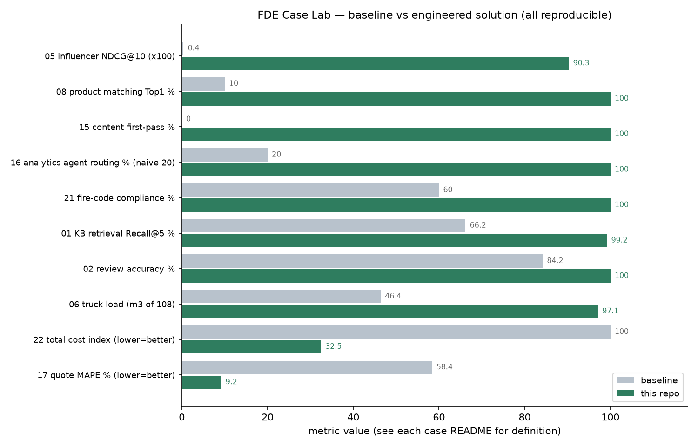

# FDE Case Lab · 真实 FDE 案例的可运行工程实现集 + AI Agent 技能包

[English brief README](README_EN.md)

[](https://github.com/JingHao-Leon/fde-case-lab/actions/workflows/ci.yml)
[](#快速开始)
[](LICENSE)


**Forward Deployed Engineer（FDE，前向部署工程师）案例集与技能库**：
16 个项目 · 106 个测试 · 真实数据回测 · 10 个可安装 SKILL.md。
案例来源：《Datawhale FDE 案例 100》（2026-09）中的 16 个真实企业落地案例；
方法论框架参考 [Awesome-FDE-Roadmap](https://github.com/pierpaolo28/Awesome-FDE-Roadmap)
（FDE 能力路线图）与 [FDEOps](https://github.com/suboss87/FDEOps)（FDE 技能包）。

> 英文一句话：*A runnable engineering lab for Forward Deployed Engineering —
> 16 case projects (retrieval, record-linkage, 3D bin packing, inventory
> simulation, deterministic semantic-layer agents) with 106 green tests and
> reproducible benchmarks, plus 10 installable AI-agent skills distilled from
> the Datawhale FDE Case 100 collection.*

每个项目 = **业务问题翻译 → 求解器 → pytest 测试 → 回测脚本**。
数据分级：2 个案例使用真实公开数据（UCI Online Retail 真实零售流水、
Amazon-Google 人工标注实体匹配基准，[来源与许可](datasets/README.md)），
其余 14 个为固定种子合成数据（模拟原案例的数据形态与植入缺陷），
所有指标可用一条命令复现，不含任何编造数字。

**覆盖的技术领域**：检索增强生成（RAG）与评测 · 实体匹配 / 记录链接 / 主数据查重 ·
三维装箱与启发式搜索 · 规则引擎与置信度分流 · 库存策略与业务联动模拟回测 ·
确定性语义层 Agent · 成本建模与校准飞轮 · 事件流异常检测 · 内容量产流水线 ·
诉讼时效规则引擎。


*11 组基线对比（全部可复现，指标定义见各案例 README；生成脚本 `scripts/gen_chart.py`）*

## 为什么做这个仓库

FDE（Forward Deployed Engineer，前向部署工程师）的核心不是调模型，而是三件事：
**把模糊的业务抱怨翻译成可计算的问题**、**在客户环境里交付可验证的方案**、
**让效果可以被持续度量**。市面上讲 FDE 方法论的内容多，可运行的工程实现少——
本仓库把 12 个真实案例中反复出现的技术模式抽出来做成可回测的代码：

| 技术模式 | 对应项目 |
|---|---|
| 词汇归一化 + 混合检索 | 01 经验知识库、08 物料搜索 |
| 规则引擎 + 置信度分流（Human-in-the-loop） | 02 办件审核、09 财务审核、08 查重 |
| 匹配排序 + 状态机提醒 | 05 达人建联 |
| 3D 装箱启发式搜索 | 06 跨境装车 |
| 事件时间线重建 + 时效规则 | 03 诉讼案件 |
| 硬约束一票否决 + 多指标评分 | 04 选址筛查 |
| 多级模糊匹配（对账/记录链接） | 10 智能对账 |
| 历史复用推荐 + 路由 | 13 维保工单 |
| 参数化生成 + 校验器链 + 回退 | 15 内容量产 |
| 确定性语义层 + 查询规划 | 16 网络分析 Agent |
| 显式成本模型 + 校准飞轮 | 17 非标报价 |
| 事件流链路重建 + 规则检测器 | 20 经营链路 |
| 规范查表 + 几何覆盖校验 | 21 消防图纸 |
| 补货策略 + 业务联动的模拟回测 | 22 补货与广告 |

## 实测结果总览（每个数字都有复现命令）

| 项目 | 核心指标 | 结果 | 对比基线 |
|---|---|---|---|
| [01 经验知识库](cases/01-knowledge-base) | 检索 Recall@5 | **99.2%**（带噪 97.1%） | 关键词 66.2%；过 80% 验收线 |
| [02 办件审核](cases/02-doc-review) | 审核准确率 / 漏放 | **100% / 0** | 自动通过 59.5%，产能 15×人工 |
| [03 诉讼时间线](cases/03-case-timeline) | 时效判定一致率 | **96.3%**（中断重算） | 1000 页材料整理 3.3 天→分钟 |
| [04 选址筛查](cases/04-site-screening) | Top10 专家重合率 | **90%**（硬约束零漏筛） | 200 块全量 0.5ms vs 1h/块 |
| [05 达人建联](cases/05-influencer-crm) | 匹配 NDCG@10 | **90.3%** | 粉丝量排序 0.4%；履约周期 -34% |
| [06 跨境装车](cases/06-truck-loading) | 首车装载量 | **97.1 方**（最低 95.8） | 达到老师傅 95~98 方水平，规划 5h→秒级 |
| [08 物料搜索](cases/08-material-search) | 查询 Top1 / 重复拦截 | 合成 **100%** / 79% 自动+0 误拦 | 真实 Amazon-Google 标题 Top1 67.9%（基线 4.3%） |
| [09 财务审核](cases/09-finance-audit) | 检出率 / 误放 | **100% / 0** | 直通 78%，科目映射 100% |
| [10 智能对账](cases/10-reconciliation) | 净差异还原误差 | **-93.8%**（4.08 万→0.25 万） | 6.3s vs 人工 100min |
| [13 维保工单](cases/13-maintenance-copilot) | 自动填充命中率 | **77%**（字符省 84%） | 路由 0%→100% |
| [15 内容量产](cases/15-content-pipeline) | 一次可用率 | **100%**（回退率 0） | 直接 AI 写 0%；日交付 400 条 |
| [16 网络分析 Agent](cases/16-network-analytics) | 路由正确率 / 稳定性 | **100% / 100%**，0.3ms | 采样 Agent 20% / 0% |
| [17 非标报价](cases/17-quoting-engine) | 报价 MAPE | **9.2%**（-30% vs 裸规则库） | 老师傅估法 58.4% |
| [20 经营链路](cases/20-ops-visibility) | 单据级异常告警 | **29 条实时**（四类全覆盖） | 月末对账 1 条且滞后 |
| [21 消防图纸](cases/21-fire-drawing) | 合规通过率 | **100%**（80ms/30 空间） | 人工习惯基线 60% |
| [22 补货+广告](cases/22-replenishment-ads) | 总成本（真实零售需求） | **-67.5%**，满足率 83.6% | 合成对照：-66.4% / 95.8% |

复现全部回测：`make bench`（或逐个运行各案例目录下的 `bench.py`）。

## 🧩 AI Agent 技能包（基于 Datawhale FDE 案例的可行 skill 研究）

参照 [FDEOps](https://github.com/suboss87/FDEOps) 的技能包形态，把 24 个案例的
方法论按**能力轴**提炼成 AI 编码代理可安装的 SKILL.md。可行性研究
（[skills/RESEARCH.md](skills/RESEARCH.md)）对 24 个案例做五维评分
（规则明确度/数据可得性/验收可量化/人机边界/复用度），结论：
**10 个一级技能可直接安装执行**，5 个二级候选，组织类工作明确不做成技能。

| 技能 | 一句话 | 参考实现 |
|---|---|---|
| [fde-discovery](skills/fde-discovery/SKILL.md) | 把模糊抱怨变成可验证的问题定义 | — |
| [kb-build](skills/kb-build/SKILL.md) | 经验知识库 + 80% 验收线 | cases/01 |
| [doc-review](skills/doc-review/SKILL.md) | 单据审核分流，误放=0 红线 | cases/02, 09 |
| [record-link](skills/record-link/SKILL.md) | 实体归一/查重/对账差异分类 | cases/08, 10 |
| [state-reminder](skills/state-reminder/SKILL.md) | 履约状态机 SLA 提醒 | cases/05 |
| [recon-chain](skills/recon-chain/SKILL.md) | 链路对账与异常告警 | cases/20 |
| [cost-quote](skills/cost-quote/SKILL.md) | 成本模型+校准飞轮报价 | cases/17 |
| [content-pipeline](skills/content-pipeline/SKILL.md) | 内容量产：生成+校验+回退 | cases/15 |
| [semantic-layer](skills/semantic-layer/SKILL.md) | 确定性语义层问答 | cases/16 |
| [timeline-check](skills/timeline-check/SKILL.md) | 时间线重建+期限检查 | cases/03 |

安装：把技能目录复制进 agent 的技能目录（与 FDEOps 的 skills CLI 兼容），
详见 [skills/README.md](skills/README.md)。

## 快速开始

```bash
# Python 3.11+，依赖只有 numpy / scikit-learn / pandas
pip install numpy scikit-learn pandas pytest

make test    # 100 个测试（约 30 秒）
make bench   # 运行全部回测
```

每个案例目录结构统一：

```
cases/06-truck-loading/
├── README.md         # 业务背景（原案例摘要）→ 技术问题 → 方案 → 实测结果
├── data_gen.py       # 固定种子合成数据（含植入缺陷/异常/查询 gold）
├── solution.py       # 求解器（基线方法 + 优化方法）
├── bench.py          # 回测：输出指标表
└── test_solution.py  # pytest 测试
```

## 两个方法论仓库的提炼

**[Awesome-FDE-Roadmap]**（1k+ star）把 FDE 能力栈分为：数据工程（地基）、
云架构（载体）、咨询思维（Forward 的本义）、应用 AI 手册（多智能体编排、
LLM 系统评测、企业级 RAG 蓝图）、气隙/边缘部署、软技能（诊断思维、
Discovery Checklist、战略框架）。本仓库的项目覆盖了其中"数据工程 +
应用 AI + 评测"三层，每个项目都内建了 Roadmap 强调的 **LLM Systems
Evaluation 思想：先定义验收指标，再谈实现**。

**[FDEOps]**（面向 AI 编码代理的 FDE 技能包）把客户接洽组织为六阶段：
Land（审视简报/赢得信任）→ Discover（界定问题/验证假设）→ Plan（排序/三选一）
→ Ship（交付增量/回滚演练）→ Outcome（成果汇报/数据看板）→ Close（运营移交/
沉淀模式），并用纯 Markdown 的"接洽记忆"（brief/success/reality/decisions）
管理每个客户。本仓库每个案例 README 都遵循同样的记录纪律：
**业务背景 → 问题定义 → 方案取舍 → 实测数字 → 测试与边界**。
特别吸收其原则："The kit says what to check. You still decide."——
所有回测脚本的角色就是"说清楚该检查什么"，业务决策权仍在客户。

## 常见问题（FAQ）

**Q：什么是 FDE（Forward Deployed Engineer）？**
FDE（前向部署工程师）是 Palantir 首创、现流行于 OpenAI/Scale AI 等公司的角色：
驻扎在客户现场，把模糊的业务问题翻译成可落地、可验证的 AI 方案，并推进到
客户的业务流程里。核心能力不是调模型，而是问题翻译、工程交付与效果度量。

**Q：这个仓库适合谁？**
三类人：想转 FDE 岗的工程师（每个案例都是一次完整的方法论演练）；
要给团队建 AI 能力的业务负责人（每个 README 都是"问题定义→方案→验收"的模板）；
做 AI Agent 技能封装的人（skills/ 目录的 SKILL.md 可直接安装）。

**Q：如何复现实验数字？**
`make test` 跑 106 个测试；`make bench` 或逐个运行 `python cases/<案例>/bench.py`
输出指标表。数据固定种子或随仓库提交的真实数据文件，离线可复现。

**Q：数据是真实的还是模拟的？**
分级声明（详见[数据说明](#数据说明诚实边界)）：案例 22 用 UCI Online Retail
真实零售流水（CC BY 4.0），案例 08 用 Amazon-Google 人工标注实体匹配基准；
其余 14 个案例的核心数据（制造经验库、车管所办件、达人履约等）为企业私有、
从未公开，因此按原案例陈述的规模与缺陷比例做固定种子合成，并在各 README
标注与原案例数字的差距。

**Q：和 Awesome-FDE-Roadmap、FDEOps 是什么关系？**
互补：Roadmap 提供 FDE 能力路线图（流程轴），FDEOps 提供技能包的组织方式
（六阶段），本仓库补上两者缺的一环——**可运行、可回测的工程实现**
（能力轴），三者可组合使用。

**Q：FDE 落地最常见的失败原因是什么？**
从 24 个案例看，前三名都不是模型：①数据拿不出来或写不回去（08/22）；
②没有先定验收标准，做完无法证明价值（01/22/24）；③组织不接受，
AI 没有嵌进现有工作流（02/13/14）。本仓库每个案例 README 的"边界"一节
都对应记录了这些坑。

## 数据说明（诚实边界）

数据分两类，来源与许可详见 [datasets/README.md](datasets/README.md)：

**真实数据（2 个案例，已随仓库提交小体积处理后文件）**
- 案例 22 补货回测：**UCI Online Retail** 真实流水（541,909 笔交易，CC BY 4.0），
  聚合为 200 SKU × 240 天真实日需求（`retail_daily.csv`，133 KB）；
- 案例 08 物料匹配：**Amazon-Google** 人工标注实体匹配基准（Magellan/DeepMatcher，
  测试 2,293 对），真实跨平台商品标题（`datasets/amazon_google/`，440 KB）。

**合成数据（其余 14 个案例，固定种子、可复现）**
- 按原案例描述的规模与形态生成（如 300 张订单、17,100 笔 POS 流水、
  2,000 张报销单），缺陷/异常按案例陈述的比例植入（如车管所材料缺陷、
  商场对账差异、报销单重复发票）；
- 无公开同构数据的原因：制造经验库、车管所办件、TAP 达人履约、消防施工图、
  非标报价等核心数据均为企业私有，从未公开；已尝试并记录的替代源见
  datasets/README.md 的"未接入"清单；
- "老师傅基线"等对照项按案例陈述的行为建模，参数在代码中显式声明；
- 个别指标与原案例公开数字存在差距且**如实标注**（如案例 06 的装载率
  97.1 方 vs 案例宣称的稳定 99 方，根因与改进方向写在案例 README）；
- 指标均为离线回测，不代表生产环境表现。

## License

MIT
