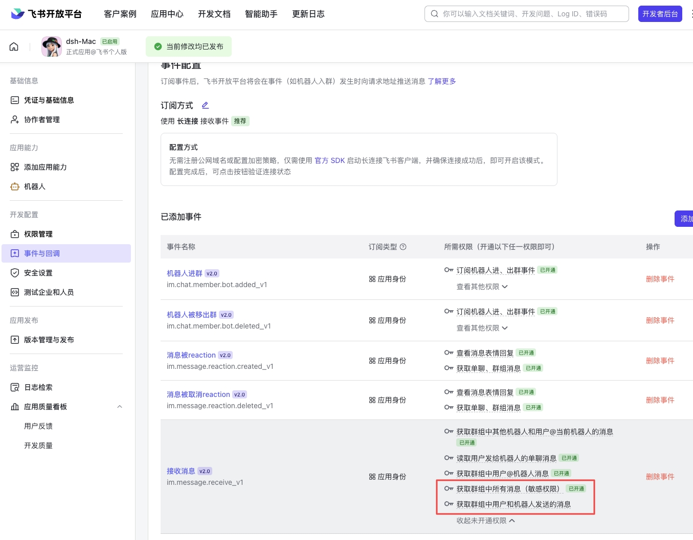

# ax-feishu-bridge

A Feishu/Lark message-bridge extension for DeepSeek Harness and Pi — keep collaborating with your local DSH/Pi right inside your familiar chat interface.

<p align="center">
  <a href="./README.md">中文</a> · <b>English</b>
</p>

DSH & Pi Feishu feedback group: <https://applink.feishu.cn/client/chat/chatter/add_by_link?link_token=57dvecbb-95d3-4d01-b689-6ebc3d17c867>

Join the group to report any issues with the extension.

## My social platforms — follow me to catch the latest AI tools first

Account name across all platforms: AX阿煊

Bilibili: <https://space.bilibili.com/4489397>


## Key Features

- Create a Feishu/Lark bot quickly by scanning a QR code — minimal manual setup
- Separate Pi sessions for DMs, group chats, and group topics
- Group chat policies:
  - `open`: reply directly in groups and topics without an @; you still need to manually enable the "**receive all messages in group chats**" permission for the bot in the Feishu developer console
  - `mention`: reply only when the bot is `@`-mentioned, a keyword matches, or someone replies to a bot message (the latter two are optional)
- Attachment inputs including images, code files, and text files; image understanding depends on whether the selected model supports images
- Parse Feishu interactive alert cards; when replying to a message or card, the original content can be passed to Pi together
- Group keyword triggers, and follow-up questions by replying to bot messages
- Switch the model, workspace, past sessions, and thinking level of the current conversation inside Feishu
- An immediate "Replying…" appears as soon as a message is received, and the answer streams into the same card; can be stopped, with a completed or failed status shown
- Render Markdown content
- Even when the Pi agent is closed, a resident background service keeps the conversation going — the Pi agent does not need to run in the foreground.

<br />

***


## Quick Start

> The quick start below begins with **DeepSeek Harness (DSH)**; Pi users can jump straight to [Pi Quick Start](#pi-quick-start).

<a id="dsh-quick-start"></a>

### DeepSeek Harness (DSH)

This extension is also distributed as a DeepSeek Harness bundle. Bot setup and the chat experience are the same as Pi.

#### 1. Install

Prerequisite: dsh is already installed on your machine

Install from npm

```bash
dsh plugin --profile web add ax-feishu-bridge --ignore-scripts
```

#### 2. Launch and First-Time Setup

After installation, restart dsh. If no Feishu bot configuration is detected, a terminal setup wizard starts automatically: it is recommended to choose "scan QR code to auto-create the Feishu assistant" and scan the QR code in the terminal as prompted; if you already have an existing Feishu/Lark app, you can also enter the App ID and App Secret manually.

After setup, the bridge starts automatically and connects to Feishu/Lark, and it reconnects automatically every time you start dsh afterwards.

> DSH uses its own config file `~/.dsh/feishu/config.harness.json`, separate from Pi's config — the two can be installed side by side and coexist.

#### 3. Interacting in Feishu

Exactly the same as Pi:

- DM: just send a message
- Group chats: whether you need to `@` the bot depends on the group policy
- Topics: each topic maps to its own independent session

**If the group policy is set to `open` and you want the bot to reply to any group message without being @-mentioned, you must also enable either the "receive all messages in group chats" or the "receive messages sent by users and bots in group chats" permission under Events and Callbacks of the bot in the Feishu developer console.**


In-chat commands like `/new`, `/resume`, `/model`, `/thinking`, `/stop`, `/workspace`, `/status`, and `/config` are also available; see "Using It in Feishu" below for the full list.

Two differences to note:

- DSH offers a trimmed-down set of `/feishu` management commands: `setup / status / autostart / debug / reset`, but no `start / stop / restart` — the bridge starts and stops automatically with dsh, controlled by `autoStart` in the config.
- DSH environment variables use the `HARNESS_` prefix (e.g. `HARNESS_APP_ID`) instead of Pi's `FEISHU_`; the card callback port also differs by default — Pi uses `3001`, DSH uses `3002`, so both can run side by side without conflicts

<a id="pi-quick-start"></a>

### Pi

#### 1. Install

```bash
pi install npm:ax-feishu-bridge
```

You can also install from Git:

```bash
pi install git:github.com/AX1202/ax-feishu-bridge
```

#### 2. Initial Setup

Run inside Pi:

```bash
/feishu setup
```

It is recommended to choose "scan QR code to auto-create the Feishu assistant" and scan the QR code in the terminal as prompted.

If you already have an existing Feishu/Lark app, you can also enter the App ID and App Secret manually.

#### 3. Start the Bridge

```bash
/feishu start
```

If auto-start is enabled, the bridge connects to Feishu/Lark automatically when a Pi session starts.

#### 4. Start Chatting

Open the bot in Feishu/Lark and just send a message.

- DM: just send a message
- Group chats: whether you need to `@` the bot depends on the group policy
- Topics: each topic maps to its own independent Pi session

**If the group policy is set to `open` and you want the bot to reply to any group message without being @-mentioned, you must also enable either the "receive all messages in group chats" or the "receive messages sent by users and bots in group chats" permission under Events and Callbacks of the bot in the Feishu developer console.**

---

# Running the Pi Agent Feishu Plugin on Windows

## Solution

### 1. Install Git for Windows first

After installation, this file usually exists:

```text
C:\Program Files\Git\bin\bash.exe
```

This is the Bash environment used by Pi on Windows.

---

### 2. Configure Pi's settings.json

Open:

```text
C:\Users\<your-username>\.pi\agent\settings.json
```

Add this line inside the braces:

```json
"shellPath": "C:\\Program Files\\Git\\bin\\bash.exe"
```

Note: if the file already contains other settings, don't remove them — just add this line.

This setting mainly tells the **Pi main program** which Bash to use.

---

### 3. Add Git Bash to the Windows PATH

Some plugins invoke directly:

```text
bash
```

They don't necessarily read Pi's `shellPath` config, so you also need to add Git Bash to the system PATH.

Run in PowerShell:

```powershell
[Environment]::SetEnvironmentVariable(
  "Path",
  [Environment]::GetEnvironmentVariable("Path", "User") + ";C:\Program Files\Git\bin",
  "User"
)
```

---

### 4. Restart PowerShell

After running the command above, close PowerShell and reopen it.

Then verify:

```powershell
where.exe bash
```

If the output is:

```text
C:\Program Files\Git\bin\bash.exe
```

the fix succeeded.

---

### 5. Run Pi again

```powershell
pi
```

---

## Summary

The most robust setup is to do both:

```text
shellPath in settings.json
+
C:\Program Files\Git\bin in the Windows PATH
```

The former is for the Pi main program; the latter is for plugins or subprocesses that invoke `bash` directly.


***

## Using It in Feishu

Common commands to send to the bot:

| Command  | Meaning                   |
| -------- | -------------------- |
| `/new`   | Start a new Pi session for the current chat      |
| `/resume` | Open the list of past sessions of the current workspace; switch to all sessions from the card |
| `/model` | Open the model picker card to switch the model of the current session |
| `/thinking` | Open the thinking-level picker to switch among the levels the current model actually supports |
| `/stop`  | Stop processing the current reply          |
| `/workspace` | View the workspace bound to the current session      |
| `/workspace /path/to/project` | Switch the current session to the given workspace; takes effect on the next message |
| `/status` | View the working status, model, thinking level, and context usage of the current session |
| `/commands` | View all commands the bot supports |
| `/config` | View runtime settings (direct messages with the bot only) |
| `/config groupKeywords keyword1,keyword2` | Set group keyword triggers, taking effect immediately |
| `/config streamingReply false` | Turn off streaming display and use a normal reply card |
| `/config clear groupKeywords` | Clear a runtime setting override |

***

## Managing It inside Pi

| Command             | Meaning             |
| ------------------- | ------------------- |
| `/feishu setup`     | Open the initial setup             |
| `/feishu start`     | Start the Feishu bridge              |
| `/feishu stop`      | Stop the Feishu bridge              |
| `/feishu restart`   | Restart the bridge and reload the latest code and config   |
| `/feishu status`    | View connection status, current owner, and config |
| `/feishu autostart` | Toggle auto-start              |
| `/feishu debug`     | View the last 20 debug log entries       |
| `/feishu reset`     | Clear config and mappings, but keep session history     |

***

## Managing It inside DSH

Type these in the DSH web composer or terminal (relies on the host DSH's command facility; silently skipped when the host doesn't provide it, without affecting the bridge itself):

| Command               | Meaning                                          |
| --------------------- | ------------------------------------------------ |
| `/feishu setup`       | Reconfigure the bot; prompts and QR code appear in the terminal where the DSH process runs, with overwrite confirmation when a config exists |
| `/feishu status`      | View connection status, current owner, and config |
| `/feishu autostart`   | Toggle auto-start                                 |
| `/feishu debug`       | View the last 20 debug log entries                |
| `/feishu reset confirm` | Clear config and mappings, but keep session history |

Difference from Pi: DSH does not provide `/feishu start | stop | restart` — the bridge starts and stops automatically with dsh. After `setup` / `reset`, restart dsh for the new config to take effect.

> Note (DSH platform limitation): command results render as collapsible command nodes in the conversation flow, but **a brand-new blank session does not render command records** — if a command seems to do nothing, send any ordinary message in that session first, then run the command. `setup` is unaffected (its prompts and QR code live in the terminal).

***

## Configuration

Config is saved by default at:

```text
~/.pi/agent/feishu/config.json
```

It can also be configured via environment variables:

| Variable                | Description                            |
| --------------------- | ----------------------------- |
| `FEISHU_APP_ID`       | Feishu/Lark app ID                 |
| `FEISHU_APP_SECRET`   | Feishu/Lark app secret                  |
| `FEISHU_DOMAIN`       | `feishu` or `lark`, default `feishu` |
| `FEISHU_GROUP_POLICY` | `open` or `mention`, default `open`  |
| `FEISHU_GROUP_KEYWORDS` | Group keywords, comma- or semicolon-separated; no @ needed when matched |
| `FEISHU_GROUP_ALSO_ON_REPLY` | When `1`, replying to bot messages continues the conversation without another @ |
| `FEISHU_IGNORE_BOT_MESSAGES` | Whether to ignore messages from other bots, default `true` |
| `FEISHU_LANGUAGE`     | `zh` or `en`                   |
| `FEISHU_REACT_EMOJI`  | Emoji reaction on message received, default `Get`      |
| `FEISHU_AUTO_START`   | `1` or `0`                     |
| `FEISHU_CARD_ACTION_MODE` | `webhook` or `ws`, default `webhook` |
| `FEISHU_CARD_ACTION_WEBHOOK_HOST` | Card callback listen address, default `0.0.0.0` |
| `FEISHU_CARD_ACTION_WEBHOOK_PORT` | Card callback port, default `3001` (DSH uses `HARNESS_CARD_ACTION_WEBHOOK_PORT`, default `3002`) |
| `FEISHU_CARD_ACTION_WEBHOOK_PATH` | Card callback path, default `/webhook/card` |
| `FEISHU_PROMPT_NOTIFY_SEC` | After a long task exceeds this many seconds, send a "still processing" notice in Feishu, default `180`, `0` disables |
| `FEISHU_PROMPT_TIMEOUT_SEC` | Hard timeout in seconds; the task is aborted and reported failed on timeout, default `0` (no hard timeout — even long-running tasks won't be reported failed) |
| `FEISHU_PARSE_INTERACTIVE_CARDS` | Whether to convert interactive cards into text Pi can read, default `true` |
| `FEISHU_INCLUDE_QUOTED_MESSAGE` | Whether to include the original message content when replying/quoting, default `true` |
| `FEISHU_QUOTED_MESSAGE_MAX_CHARS` | Max characters to include from a quoted message, default `8000` |
| `FEISHU_SEND_MAX_RETRIES` | Retry count on transient Feishu API failures, default `2` |
| `FEISHU_STREAMING_REPLY` | Whether to enable CardKit single-card streaming replies, default `true` |
| `FEISHU_STREAM_PRINT_FREQUENCY_MS` | Refresh interval for streaming character-by-character display, default `50` |
| `FEISHU_STREAM_PRINT_STEP` | Number of characters shown per step, default `1` |
| `FEISHU_STREAM_PUSH_INTERVAL_MS` | Interval for pushing the latest content to Feishu, default `120` ms |
| `FEISHU_EXT_DEV`      | When `1`, show the local development badge `DEV`           |

### config.json fields

In addition to the environment variables above, you can also set these in `config.json` (priority: env vars > config.json > defaults):

| Field                 | Description                            |
| --------------------- | ----------------------------- |
| `promptNotifySec`     | After a long task exceeds this many seconds, send a "still processing" notice in Feishu, default `180`, `0` disables |
| `promptTimeoutSec`    | Hard timeout in seconds; the task is aborted and reported failed on timeout, default `0` (no hard timeout — even long-running tasks won't be reported failed) |

> Note: long-running tasks (e.g. running tests, builds, batch processing) are **not** reported as "task failed" by default — once `promptNotifySec` is reached, Feishu only shows "the task is still processing", the reply card stays "replying", and the result is delivered normally when done. A hard timeout only applies when `promptTimeoutSec` is explicitly set. Run `/feishu restart` after changes for them to take effect.

### Runtime settings

The following bridge settings can be changed instantly with `/config` **in a direct message with the bot** — no restart needed — and are saved to `~/.pi/agent/feishu/runtime-overrides.json`:

```text
/config
/config groupKeywords alert,alerts
/config groupAlsoOnReply true
/config streamingReply false
/config clear groupKeywords
/config clear all
```

The hot-updatable scope only includes `groupPolicy`, `groupKeywords`, `groupAlsoOnReply`, `ignoreBotMessages`, `reactEmoji`, `language`, and the streaming display parameters; app credentials, quoted-message expansion, and connection mode cannot be changed via chat.

***

## Stored Files

| Path                               | Content                |
| -------------------------------- | ----------------- |
| `~/.pi/agent/feishu/config.json` | Bot credentials and basic config        |
| `~/.pi/agent/feishu/runtime-overrides.json` | Runtime setting overrides saved via `/config` in DMs |
| `~/.pi/agent/feishu/state.json`  | Mapping between Feishu chats and Pi sessions    |
| `~/.pi/agent/feishu/bridge.json` | Routing info for Pi tasks started from Feishu  |
| `~/.pi/agent/feishu/debug.log`   | Debug log              |
| `~/.pi/agent/locks.json`         | Owner lock of the current Feishu connection   |
| `~/.pi/agent/sessions/`          | Pi session files for each Feishu chat |

***

## Notes

- Whether images can be recognized depends on whether the selected model supports image input.
- Image and text/code file inputs are existing capabilities; interactive card parsing and reply-context expansion are capabilities added in newer versions.
- When you "reply" to a message or card, Pi sees the original content plus your new question; this does not re-send the original message to the group.
- `/feishu reset` only clears config and mappings; it never deletes session history.
- Tasks created from TUI, CLI, or other channels are not proactively pushed to Feishu.
- `/workspace` currently only supports absolute paths, or paths starting with `~/`.
- `/resume` first shows the recent sessions of the current project by default; you can switch to "all sessions" in the card and page through them.
- Card buttons now prefer webhook response mode; if you want to temporarily keep the older WS update flow, set `FEISHU_CARD_ACTION_MODE` to `ws`.
- The card callback listens on `0.0.0.0:3001/webhook/card` (Pi) / `0.0.0.0:3002/webhook/card` (DSH) by default; you need to point the interactive card callback URL to an externally reachable URL in the Feishu developer console.

***

## FAQ

### Why isn't the bot replying?

Check three things:

- Whether the Feishu bot has been created and configured
- Whether `/feishu start` has been run
- Whether the group policy requires `@`-mentioning the bot

### I sent a message in the group, why did the bot ignore me?

If you set the group policy to `mention`, the bot replies only after being `@`-mentioned.\
In `open` mode: it can reply directly in groups and topics without an @, but you still need to manually enable the "receive all messages in group chats" permission for the bot in the Feishu developer console for it to take effect.

### Boot auto-start of the background service is not implemented yet; currently you need to manually start the Pi agent once after the computer boots for it to work properly. Once started, the Pi agent does not need to run in the foreground — even after it is closed, you can still chat in Feishu/Lark.
